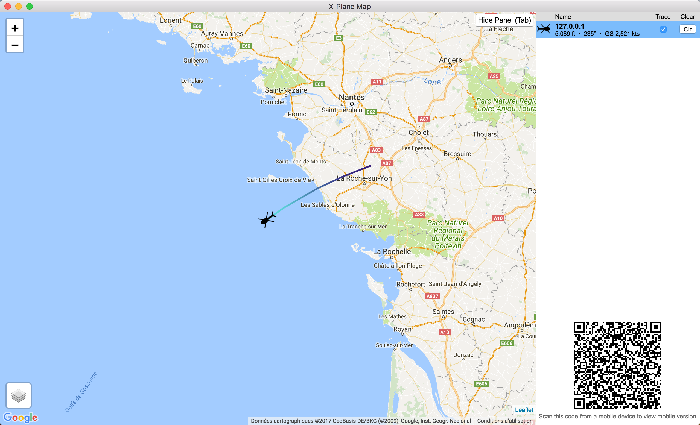

# X-Plane-Map by @foucdeg

## How it Works

X-Plane can be configured to send out aircraft location data over the network.
This application listens to those network exchanges and displays your aircraft on a Google Map.

The setup screen will help you get started.

## Need help ?

If you cannot get the map to work, email me (I left an email address in the About window of the map).

For any bug reports or feature requests/ideas, leave an [issue on Github](https://github.com/foucdeg/x-plane-map-electron/issues).

## Changelog

### 2.0.0

Version 2.0.0 is a full rewrite of X-Plane Map, using Electron to make it a cross-platform desktop app.
Some added features:

 - New setup page explaining use cases and full configuration
 - Plane icon change
 - Plane trace color varies with altitude
