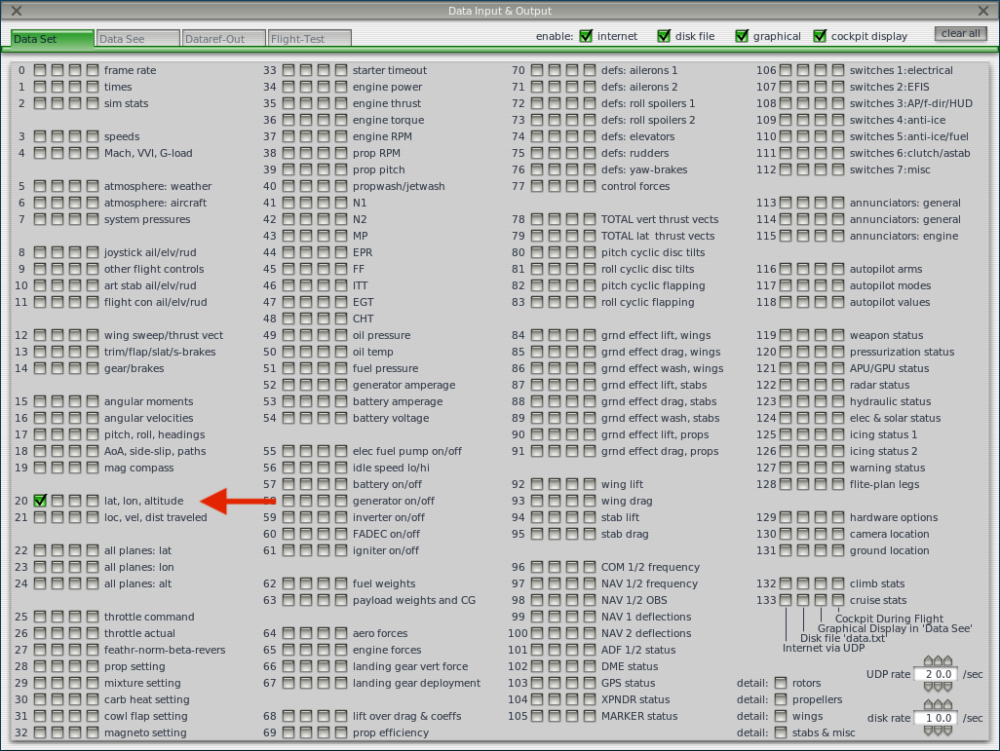

# X-Plane Config

In Settings > Data Input & Output, under the Data Set tab, check data line 20 for UDP output (first checkbox).

In Settings > Net Connections, under the Data tab, enter the IP and port indicated on the setup screen.

