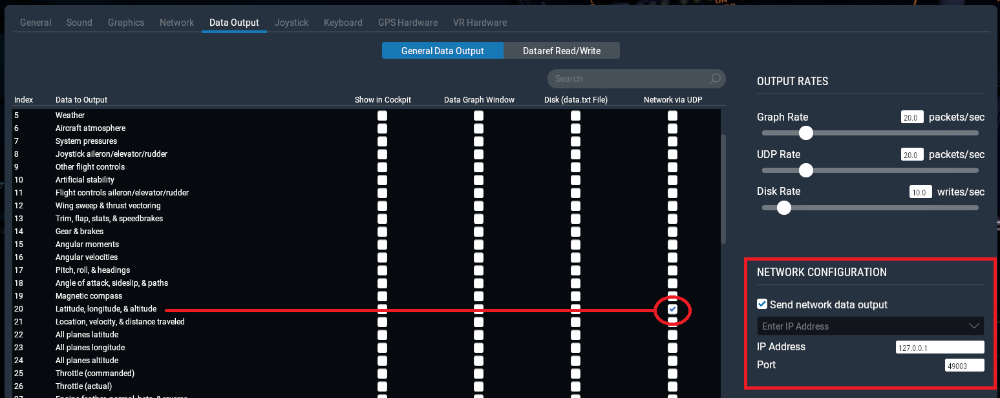

## X-Plane Config

### X-Plane 11

In Settings > Data Output, under the General Data Output tap, check data line 20 for UDP output (last checkbox).

On the bottom right side, enter the IP and port indicated on the setup screen and check the "Send network data output" checkbox.

### X-Plane 10
In Settings > Data Input & Output, under the Data Set tab, check data line 20 for UDP output (first checkbox).

In Settings > Net Connections, under the Data tab, enter the IP and port indicated on the setup screen.

⬅ [Back to home](./)
